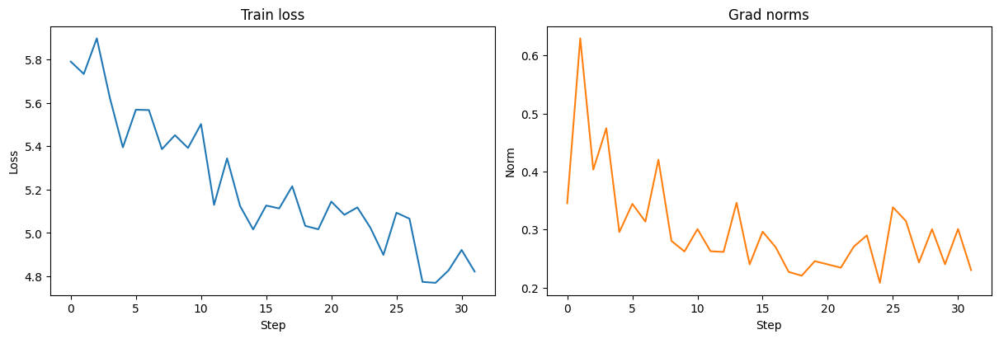

# Zero-Order Fine-Tuning of ResNet18 on CIFAR100

## Initial considerations 
Firstly, I launched the baseline FT, which led to almost NO performance gain over an unfitted model. It led to the following considerations:
* ZO is quite noisy (gradient estimates are noisier than "backward-acquired" + they differ between themselves significantly) -> so proper trainig requires a big number of iterations + accurate ZO hyperparameters tuning
* CIFAR100 is not natural data for ResNet -> adaptation requires iterations

## SPSA trials
Another step of my research was trying of SPSA optimizer on this task. It happened to be fast, but way too noisy (estimated gradients exploded to huge values). Tuning of (A), (a) and (c) did not help to gain better quality within our compute budget. But I noted one important thing -> SPSA moves fast over the parameter space (due to it's direction sampling for ALL the active params), so it can be used along with smth else to speeding up, like "shakinng" steps.

## DeepZero trials
DeepZero allows us more accurate steps due to perturbing only fixed number of parameters. I trued to tune it withing the compute budget (32 iterations on 128-sized batches prooved to perform as best), varied learning rate and the number of perturbed parameter points (from 256 to 1024). Reached **3.81%** accuracy (at least better, than the raw model). This experiment can be seen in experiments_deepzero_spsa.ipynb in this repo. Train dynamics is here (loss gradually reduces, gradients are valid):

  

## Combined approach
Finally, I decided to combine DeepZero and SPSA: alternate 1 SPSA step (for fast movement) and 5 DeepZero steps for local refinements. But due to the lack of time I haven't conducted experiments for this mulual optimizer. But sounds promising, nevertheless!

## Conclusion
ZO proved to be quite a noisy trainig scheme - and for good convergence it requires a much higher iterations than allowed by our bidget. If we increase the number of iterations even for DeepZero alone - it is likely to work better. Plus, increasing the number of perturbed point can be set higher than 1024 - but then the iteration will take much more time.